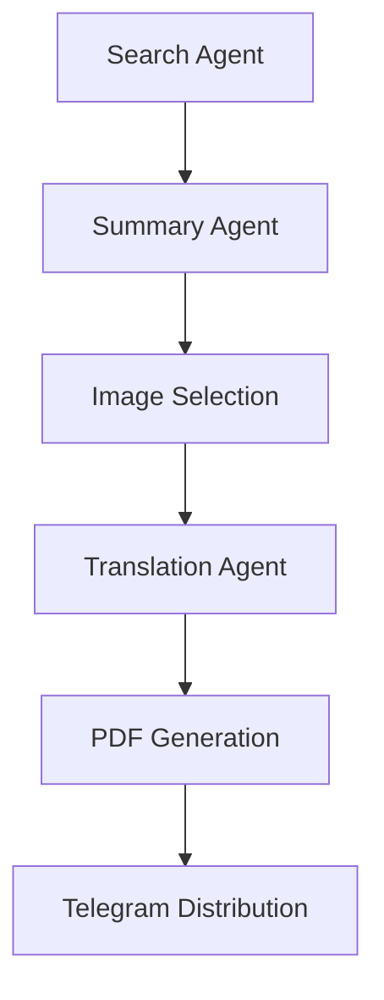

# Tzuroni_Internship

# CrewAI Financial Daily Summary

A comprehensive financial news aggregation and summarization system that automatically collects, processes, and distributes daily market summaries in multiple languages. This project implements a CrewAI-style agent workflow to create professional PDF reports with real-time financial data.

## 🚀 Features

- **Automated News Collection**: Fetches real-time US financial news using Serper and Tavily search APIs
- **AI-Powered Summarization**: Generates concise, professional summaries using LLM models
- **Multi-Language Support**: Translates summaries into Arabic, Hindi, and Hebrew
- **Professional PDF Generation**: Creates formatted PDF reports with embedded images
- **Telegram Integration**: Automatically sends reports to Telegram channels
- **Modular Agent Architecture**: Clean separation of concerns with dedicated agents for each task

## 🛠 Installation

### Prerequisites

- Python 3.8 or higher
- API keys for required services (see [API Requirements](#api-requirements))

### Install Dependencies

```bash
pip install -r requirements.txt
```

### Additional Dependencies

For the financial summary script specifically, you may need:

```bash
pip install crewai litellm requests python-telegram-bot==13.15 reportlab Pillow PyPDF2
```

## ⚙️ Configuration

### Environment Variables

Set the following environment variables in your `.env` file or system environment:

```bash
# Search APIs (choose one or both)
SERPER_API_KEY=your_serper_api_key
TAVILY_API_KEY=your_tavily_api_key

# LLM Configuration
LITELLM_API_KEY=your_litellm_api_key
LLM_MODEL=gpt-4o-mini  # Optional, defaults to gpt-4o-mini

# Telegram Integration (optional)
TELEGRAM_BOT_TOKEN=your_telegram_bot_token
TELEGRAM_CHANNEL_ID=your_telegram_channel_id
```

### API Keys Setup

1. **Serper API**: Sign up at [serper.dev](https://serper.dev) for Google search API access
2. **Tavily API**: Get API key from [tavily.com](https://tavily.com) for enhanced search
3. **LiteLLM**: Configure with your preferred LLM provider (OpenAI, Anthropic, etc.)
4. **Telegram Bot**: Create a bot via [@BotFather](https://t.me/botfather) and get channel ID

## 🚀 Usage

### Basic Usage

Run the financial daily summary:

```bash
python crew_ai_financial_daily_summary.py --run
```

### Command Line Options

```bash
# Run the complete workflow
python crew_ai_financial_daily_summary.py --run

# Check configuration (without running)
python crew_ai_financial_daily_summary.py
```

### Programmatic Usage

```python
from crew_ai_financial_daily_summary import crewai_flow_run

# Run the complete workflow
success = crewai_flow_run()
if success:
    print("Daily summary generated successfully!")
```

## 🏗 Architecture

The system implements a multi-agent workflow inspired by CrewAI:

### Agent Workflow



### Agent Responsibilities

1. **Search Agent** (`search_agent_us_financial_news`)
   - Queries multiple search APIs (Serper, Tavily)
   - Deduplicates results
   - Focuses on US financial markets and recent news

2. **Summary Agent** (`summary_agent_generate`)
   - Processes search results
   - Generates concise, professional summaries
   - Maintains factual accuracy

3. **Image Selection** (`select_images_from_results`)
   - Extracts relevant images from search results
   - Provides fallback placeholder images
   - Optimizes for PDF layout

4. **Translation Agent** (`translating_agent_translate`)
   - Translates summaries to multiple languages
   - Preserves formatting and structure
   - Supports Arabic, Hindi, and Hebrew

5. **PDF Generation** (`create_pdf`)
   - Creates professional PDF layouts
   - Embeds images and formatted text
   - Handles multi-language content

6. **Distribution Agent** (`send_to_telegram`)
   - Sends PDF reports to Telegram channels
   - Includes captions and metadata
   - Handles delivery confirmations

## 🔌 API Requirements

### Required APIs

| Service | Purpose | Free Tier | Documentation |
|---------|---------|-----------|---------------|
| Serper | Web search | 2,500 queries/month | [serper.dev](https://serper.dev) |
| LiteLLM | LLM access | Varies by provider | [litellm.ai](https://litellm.ai) |

### Optional APIs

| Service | Purpose | Free Tier | Documentation |
|---------|---------|-----------|---------------|
| Tavily | Enhanced search | 1,000 queries/month | [tavily.com](https://tavily.com) |
| Telegram Bot API | Distribution | Free | [core.telegram.org](https://core.telegram.org/bots) |

## 📄 Output

### Generated Files

- **PDF Report**: `daily_summary_YYYYMMDD.pdf`
  - English summary with market analysis
  - Translated versions in Arabic, Hindi, Hebrew
  - Embedded financial charts and images
  - Professional formatting

### Sample Output Structure

```
daily_summary_20241201.pdf
├── English Summary
│   ├── Key market movements
│   ├── Trading activity highlights
│   └── Market drivers analysis
├── Arabic Summary (العربية)
├── Hindi Summary (हिन्दी)
├── Hebrew Summary (עברית)
└── Financial Charts & Images
```

### Telegram Distribution

When configured, reports are automatically sent to your Telegram channel with:
- PDF attachment
- Descriptive caption
- Date stamp
- Delivery confirmation

## 🔧 Customization

### Adding New Languages

To add support for additional languages:

1. Update the `LANGUAGE_CODES` dictionary:
```python
LANGUAGE_CODES = {
    "arabic": "ar", 
    "hindi": "hi", 
    "hebrew": "he",
    "spanish": "es",  # Add new language
    "french": "fr"    # Add new language
}
```

2. Modify the translation loop in `crewai_flow_run()`:
```python
for lang in ["arabic", "hindi", "hebrew", "spanish", "french"]:
    translations[lang] = translating_agent_translate(summary_en, lang)
```

### Customizing Search Queries

Modify the search query in `search_agent_us_financial_news()`:

```python
query = "Your custom financial news query"
```

### PDF Layout Customization

Adjust the PDF generation in `create_pdf()`:
- Change page size and margins
- Modify font styles and sizes
- Adjust image placement and sizing
- Customize section headers

## 🐛 Troubleshooting

### Common Issues

1. **API Key Errors**
   - Verify all API keys are correctly set
   - Check API quotas and billing status
   - Ensure proper environment variable loading

2. **Search Failures**
   - The system automatically falls back between Serper and Tavily
   - Check internet connectivity
   - Verify search API endpoints are accessible

3. **LLM Errors**
   - Confirm LiteLLM configuration
   - Check model availability and pricing
   - Verify API rate limits

4. **PDF Generation Issues**
   - Ensure sufficient disk space
   - Check image URL accessibility
   - Verify PIL/Pillow installation

5. **Telegram Delivery**
   - Verify bot token and channel ID
   - Check bot permissions in the channel
   - Ensure file size limits are respected

### Debug Mode

Enable detailed logging:

```python
import logging
logging.basicConfig(level=logging.DEBUG)
```

## 📊 Performance

### Typical Runtime

- **Search Phase**: 10-30 seconds
- **Summary Generation**: 15-45 seconds
- **Translation**: 30-90 seconds (3 languages)
- **PDF Creation**: 5-15 seconds
- **Telegram Upload**: 5-20 seconds

**Total Runtime**: 1-3 minutes (depending on API response times)

### Resource Usage

- **Memory**: ~100-200MB peak usage
- **Network**: ~10-50MB data transfer
- **Storage**: ~1-5MB per generated PDF

## 🤝 Contributing

We welcome contributions! Please see our contributing guidelines:

1. Fork the repository
2. Create a feature branch
3. Make your changes
4. Add tests if applicable
5. Submit a pull request

### Development Setup

```bash
git clone <repository-url>
cd CrewAI-Financial-Daily-Summary
pip install -r requirements.txt
pip install -r requirements-dev.txt  # If available
```

## 📝 License

This project is licensed under the MIT License - see the [LICENSE](LICENSE) file for details.

## 🙏 Acknowledgments

- [CrewAI](https://github.com/joaomdmoura/crewAI) for the agent workflow inspiration
- [LiteLLM](https://github.com/BerriAI/litellm) for LLM abstraction
- [Serper](https://serper.dev) and [Tavily](https://tavily.com) for search capabilities
- [ReportLab](https://www.reportlab.com) for PDF generation

## 📞 Support

For support and questions:

- Create an issue in the repository
- Check the troubleshooting section
- Review API documentation for external services

---

**Note**: This is a template implementation. You must configure your own API keys and may need to adapt the code for your specific LLM provider and requirements.
